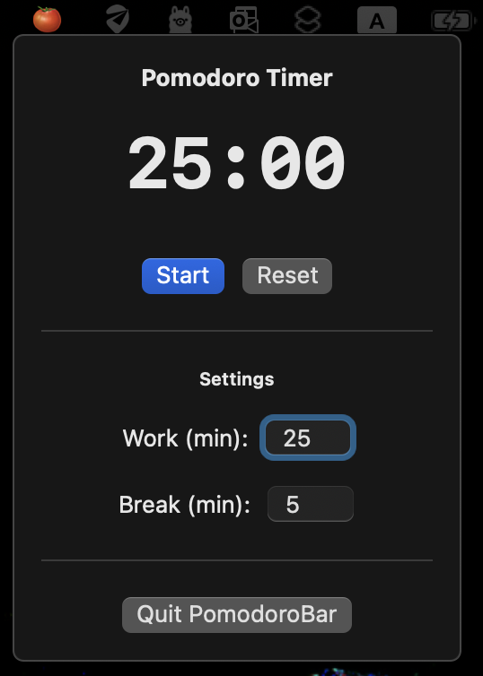

# SolanumBar: Minimalistic Pomodoro Timer for macOS

SolanumBar is a simple, elegant Pomodoro timer that lives in your macOS menu bar. Track your work sessions and breaks with a minimalist interface, customizable durations, and native notifications.

## Features

- 🍅 Menu bar integration for distraction-free productivity
- ⏱️ Customizable work and break intervals
- 🔔 Native macOS notifications
- 💾 Persistence of user settings

## Installation

### Option 1: Download the release
1. Visit the [Releases](https://github.com/yourusername/SolanumBar/releases) page
2. Download the latest `.dmg` file
3. Open the `.dmg` and drag SolanumBar to your Applications folder
4. Launch SolanumBar from your Applications folder

### Option 2: Build from source
1. Clone this repository
2. Open `SolanumBar.xcodeproj` in Xcode
3. Select Product > Archive
4. Click on "Distribute App" and select "Copy App"
5. Move the exported app to your Applications folder

## Usage

- Click on the tomato icon (🍅) in your menu bar to access the timer
- Press "Start" to begin a work session
- When the timer completes, you'll receive a notification
- The timer automatically switches between work and break modes
- Customize durations in the settings section

## Roadmap

### Short-term goals
- Sound options for notifications
- Long break feature after multiple work sessions

### Long-term vision
- **iPhone Integration**
  - Synchronized timers across devices
  - Widget support for iOS home screen
  - Focused mode integration with iOS Focus

- **Apple Watch Integration**
  - Complications for watch face
  - Haptic feedback for timer completion
  - Quick timer start from watch

## Contributing

Contributions are welcome! Please feel free to submit a Pull Request.

1. Fork the repository
2. Create your feature branch (`git checkout -b feature/amazing-feature`)
3. Commit your changes (`git commit -m 'Add some amazing feature'`)
4. Push to the branch (`git push origin feature/amazing-feature`)
5. Open a Pull Request

## License

This project is licensed under the MIT License - see the LICENSE file for details.

## Acknowledgments

- Inspired by the Pomodoro Technique® created by Francesco Cirillo
- Built with SwiftUI
